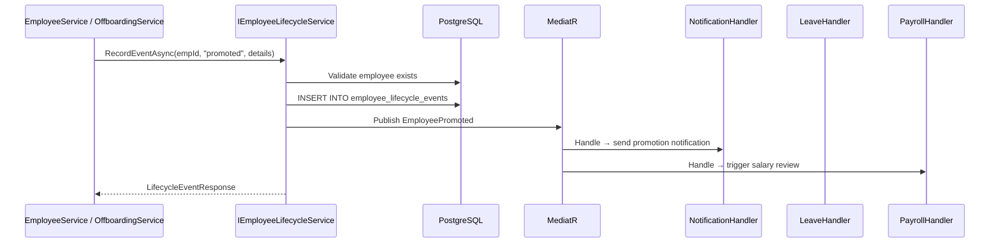

# Employee Lifecycle — End-to-End Logic

**Module:** Core HR
**Feature:** Employee Lifecycle

---

## Flow Overview

Employee Lifecycle tracks all significant employment events: hired, promoted, transferred, salary_change, suspended, terminated, and resigned. Each event creates an immutable audit record in `employee_lifecycle_events` and publishes a corresponding domain event consumed by notifications, leave, payroll, and agent-gateway modules.

---

## Step-by-Step Flow

### 1. Record Lifecycle Event (Internal — triggered by other service actions)

```
IEmployeeLifecycleService.RecordEventAsync(employeeId, eventType, detailsJson, performedById)
  → Validate: employee exists and is active
  → Validate: eventType is a known enum value
  → Build EmployeeLifecycleEvent entity
      - tenant_id from current tenant context
      - event_date = DateTime.UtcNow (or explicit date from caller)
      - details_json = serialized event-specific data
      - performed_by_id = user who initiated the action
  → _dbContext.EmployeeLifecycleEvents.Add(event)
  → _dbContext.SaveChangesAsync()
  → Publish domain event based on event_type:
      - hired → EmployeeCreated { EmployeeId, DepartmentId, HireDate }
      - promoted → EmployeePromoted { EmployeeId, OldJobTitleId, NewJobTitleId, EffectiveDate }
      - transferred → EmployeeTransferred { EmployeeId, OldDepartmentId, NewDepartmentId }
      - terminated/resigned → EmployeeTerminated { EmployeeId, Reason, LastWorkingDate }
  → Return LifecycleEventResponse
```

### 2. Query Lifecycle History

```
GET /api/v1/employees/{id}/lifecycle
  → EmployeesController.GetLifecycle(id)
    → IEmployeeLifecycleService.GetEventsAsync(employeeId, tenantId)
      → Query employee_lifecycle_events
          WHERE employee_id = @employeeId
          AND tenant_id = @tenantId
          ORDER BY event_date DESC, created_at DESC
      → Map to List<LifecycleEventResponse>
      → Return 200 OK
```

### 3. Domain Event Consumers

```
EmployeeCreated →
  ├─ NotificationHandler: Send welcome notification to employee + manager
  └─ LeaveHandler: Initialize annual leave balances (pro-rated if mid-year)

EmployeePromoted →
  ├─ NotificationHandler: Notify employee, old manager, new manager
  └─ PayrollHandler: Trigger salary review workflow

EmployeeTransferred →
  └─ NotificationHandler: Notify employee, old dept head, new dept head

EmployeeTerminated →
  ├─ LeaveHandler: Forfeit remaining leave balances
  ├─ PayrollHandler: Trigger final settlement calculation
  └─ AgentGatewayHandler: Revoke all active agent sessions
```

---

## Sequence Diagram



---

## Error Scenarios

| Step | Error | Handling |
|:-----|:------|:---------|
| Employee lookup | Employee not found or soft-deleted | Throw NotFoundException (404) |
| Invalid event_type | Unknown enum value | Throw ValidationException (400) |
| details_json | Invalid JSON structure for event type | Throw ValidationException (400) |
| DB write | Constraint violation | Transaction rolls back, return 500 |
| Event consumer failure | Notification service unavailable | Consumer logs error, does NOT block lifecycle record (fire-and-forget with retry) |

---

## Edge Cases

1. **Rapid successive events**: An employee promoted and transferred on the same day creates two separate lifecycle records with the same event_date. The `created_at` timestamp provides ordering within the same day.
2. **Terminated employee**: After termination, no further lifecycle events can be recorded. The service checks `employment_status` before accepting events.
3. **Back-dated events**: Events with explicit `event_date` in the past are allowed for HR corrections (e.g., recording a promotion that was effective last month). The `created_at` always reflects actual insertion time.
4. **details_json schema**: Each event type has its own expected JSON schema (e.g., promoted expects `old_job_title_id`, `new_job_title_id`). The service validates the JSON shape before persisting.

## Related

- [[employee-lifecycle|Employee Lifecycle Overview]]
- [[employee-profiles]]
- [[onboarding]]
- [[offboarding]]
- [[compensation]]
- [[event-catalog]]
- [[error-handling]]
