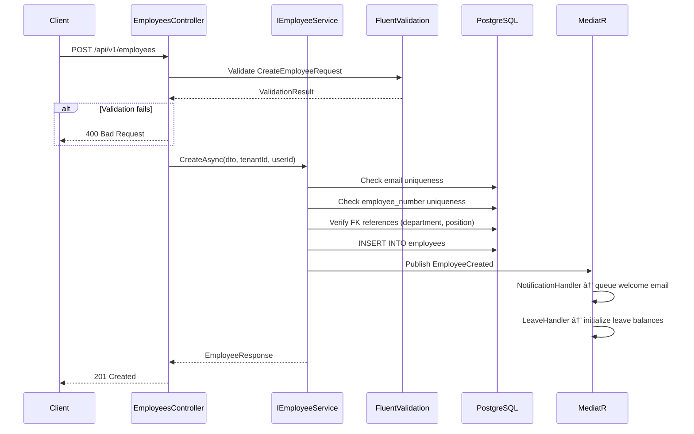

# Employee Profiles — End-to-End Logic

**Module:** Core HR
**Feature:** Employee Profiles

---

## Flow Overview

Employee Profiles is the central hub entity for all HR data. Every employee record is linked 1:1 to a `users` row via `user_id`. Reporting hierarchy is resolved from active position assignments and the position reporting tree; employee records do not store manager references. The feature supports full CRUD with soft delete, plus sub-resources for addresses, emergency contacts, and custom fields.

---

## Step-by-Step Flow

### 1. Create Employee

```
POST /api/v1/employees
  → EmployeesController.Create(CreateEmployeeRequest)
    → IEmployeeService.CreateAsync(dto, tenantId, performedById)
      → Validate: email uniqueness (per tenant), employee_number uniqueness
      → Validate: department_id and selected position exist when provided
      → Validate: legal_entity_id belongs to tenant
      → Map DTO → Employee entity
      → _dbContext.Employees.Add(employee)
      → _dbContext.SaveChangesAsync()  // single transaction
      → Publish EmployeeCreated domain event
      → Return EmployeeResponse (201 Created)
```

### 2. Update Employee

```
PUT /api/v1/employees/{id}
  → EmployeesController.Update(id, UpdateEmployeeRequest)
    → IEmployeeService.UpdateAsync(id, dto, tenantId, performedById)
      → Fetch employee by id + tenant_id (throw 404 if not found or is_deleted)
      → Validate: if email changed, check uniqueness
      → Validate: employee profile updates do not accept manager changes; position hierarchy cycle checks happen in Org Structure
      → Detect changes for lifecycle events (department change → EmployeeTransferred)
      → Apply changes to entity
      → _dbContext.SaveChangesAsync()
      → Publish domain events based on detected changes
      → Return EmployeeResponse (200 OK)
```

### 3. Soft Delete Employee

```
DELETE /api/v1/employees/{id}
  → EmployeesController.Delete(id)
    → IEmployeeService.SoftDeleteAsync(id, tenantId, performedById)
      → Fetch employee (throw 404 if not found or already deleted)
      → Set is_deleted = true, termination_date = DateTime.UtcNow
      → _dbContext.SaveChangesAsync()
      → Publish EmployeeTerminated domain event
      → Return 204 No Content
```

### 4. Get Own Profile

```
GET /api/v1/employees/me
  → EmployeesController.GetMe()
    → Extract user_id from backend-held auth/session state
    → IEmployeeService.GetByUserIdAsync(userId, tenantId)
      → Query employees WHERE user_id = @userId AND tenant_id = @tenantId AND is_deleted = false
      -> Include: addresses, emergency contacts, department, position
      → Return EmployeeDetailResponse (200 OK)
```

### 5. Get Direct Reports

```
GET /api/v1/employees/{id}/team
  → EmployeesController.GetTeam(id)
    → IEmployeeService.GetDirectReportsAsync(id, tenantId)
      → Query employee_hierarchy_closure WHERE ancestor_employee_id = @id AND depth = 1, then load active employees by descendant ids
      → Return List<EmployeeSummaryResponse> (200 OK)
```

---

## Sequence Diagram



---

## Error Scenarios

| Step | Error | HTTP Code | Handling |
|:-----|:------|:----------|:---------|
| Validation | Missing required fields (first_name, last_name, email) | 400 | FluentValidation returns field-level errors |
| Validation | Invalid email format | 400 | Regex validation in validator |
| Uniqueness | Duplicate email within tenant | 409 | Service checks before insert, returns ConflictException |
| Uniqueness | Duplicate employee_number within tenant | 409 | Service checks before insert |
| FK reference | department_id does not exist | 422 | Service validates FK, returns UnprocessableEntityException |
| Position hierarchy | selected position creates unresolved or invalid reporting chain | 422 | Org Structure validates position reporting and occupancy before assignment |
| Soft delete | Employee already deleted | 404 | Global query filter on is_deleted = false |
| Concurrency | Optimistic concurrency conflict | 409 | EF Core concurrency token on row version |
| Auth | Missing `employees:write` permission | 403 | Permission middleware rejects |

---

## Edge Cases

1. **Position-derived reporting:** Employee profile commands must not accept manager fields. Position hierarchy cycle validation belongs to Org Structure, and employee scope queries use `employee_hierarchy_closure`.
2. **Soft delete cascading**: Soft-deleting an employee does NOT cascade to dependents, addresses, or emergency contacts. Those remain for audit purposes. However, the employee no longer appears in active queries.
3. **Employee number generation**: If `employee_number` is not provided, the system auto-generates it using a tenant-scoped sequence: `{tenant_prefix}-{padded_sequence}`.
4. **Avatar file**: `avatar_file_id` references the documents module. If the referenced file is deleted, the avatar shows a default placeholder.
5. **Tenant isolation**: Every query includes `tenant_id` filtering. The global query filter ensures no cross-tenant data leakage.
6. **PII fields**: `date_of_birth` is PII and should be excluded from list endpoints; only included in detail views for authorized roles.

## Related

- [[modules/core-hr/employee-profiles/overview|Employee Profiles Overview]]
- [[modules/core-hr/employee-lifecycle/overview|Employee Lifecycle]]
- [[modules/core-hr/onboarding/overview|Onboarding]]
- [[modules/core-hr/offboarding/overview|Offboarding]]
- [[modules/core-hr/compensation/overview|Compensation]]
- [[backend/messaging/event-catalog|Event Catalog]]
- [[backend/messaging/error-handling|Error Handling]]


