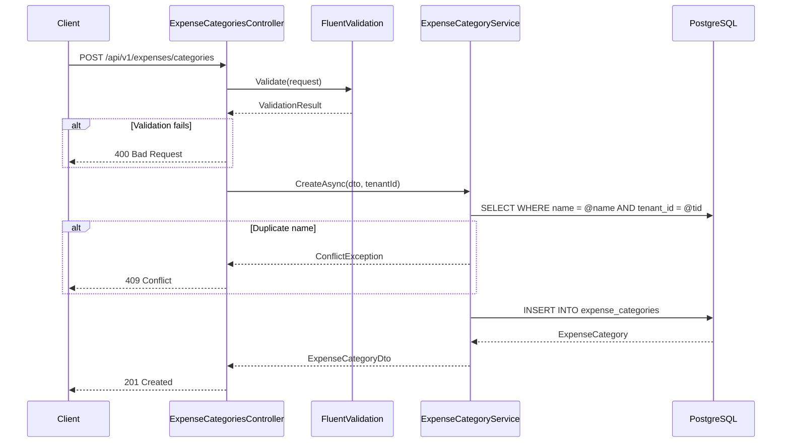

# Expense Categories — End-to-End Logic

**Module:** Expense
**Feature:** Expense Categories

---

## Flow Overview

Expense categories are tenant-scoped lookup entities that define what types of expenses employees can claim. Each category can enforce a `max_amount` ceiling and a `requires_receipt` flag. Categories are referenced by `expense_items` when building claims.

---

## Step-by-Step Flow

### 1. Create Category

```
POST /api/v1/expenses/categories
Authorization: Bearer {token}  (requires expense:manage)
```

1. **Controller** receives `CreateExpenseCategoryRequest { Name, MaxAmount?, RequiresReceipt }`.
2. **Validation** (FluentValidation):
   - `Name` is required, max 100 chars.
   - `MaxAmount` if provided must be > 0.
   - Duplicate name check within tenant (case-insensitive).
3. **Service** (`ExpenseCategoryService.CreateAsync`):
   - Extracts `tenant_id` from `ITenantContext`.
   - Builds `ExpenseCategory` entity with `is_active = true`.
4. **Repository** inserts into `expense_categories` table.
5. **Response**: `201 Created` with `ExpenseCategoryDto`.

### 2. List Categories

```
GET /api/v1/expenses/categories?isActive=true
Authorization: Bearer {token}  (requires expense:read)
```

1. **Controller** receives optional `isActive` filter.
2. **Service** queries `expense_categories` filtered by `tenant_id` (from `ITenantContext`).
3. If `isActive` param provided, filters by `is_active`.
4. **Response**: `200 OK` with `List<ExpenseCategoryDto>`.

### 3. Update Category

```
PUT /api/v1/expenses/categories/{id}
Authorization: Bearer {token}  (requires expense:manage)
```

1. **Controller** receives `UpdateExpenseCategoryRequest { Name, MaxAmount?, RequiresReceipt, IsActive }`.
2. **Validation**:
   - Category must exist and belong to current tenant.
   - If `Name` changed, duplicate check within tenant.
   - Cannot deactivate a category that has open (draft/submitted) claims referencing it.
3. **Service** updates entity fields.
4. **Repository** saves changes.
5. **Response**: `200 OK` with updated `ExpenseCategoryDto`.

### 4. Delete Category (Soft)

```
DELETE /api/v1/expenses/categories/{id}
Authorization: Bearer {token}  (requires expense:manage)
```

1. Sets `is_active = false` (soft delete).
2. Validates no in-progress claims reference this category.
3. **Response**: `204 No Content`.

---

## Sequence Diagram



---

## Error Scenarios

| Step | Error | HTTP Status | Handling |
|:-----|:------|:------------|:---------|
| Validation | Empty name or negative max_amount | 400 | FluentValidation returns field-level errors |
| Duplicate check | Category name already exists for tenant | 409 | `ConflictException` with message |
| Update/Delete | Category not found or wrong tenant | 404 | `NotFoundException` |
| Deactivate | Category has open claims | 422 | `BusinessRuleException` — cannot deactivate while claims in progress |
| Auth | Missing permission `expense:manage` | 403 | Authorization middleware rejects |

---

## Edge Cases

1. **Max amount set to null**: Category has no spending ceiling — unlimited per item.
2. **Changing max_amount on active category**: Does not retroactively affect already-submitted claims. Only new expense items validate against the updated limit.
3. **Reactivating a category**: Setting `is_active = true` on a previously deactivated category makes it available for new claims again.
4. **Tenant isolation**: All queries include `tenant_id` filter. A category from tenant A is never visible to tenant B.

## Related

- [[expense-categories]] — feature overview
- [[expense-claims]] — claims that consume categories in line items
- [[event-catalog]] — events produced during category lifecycle
- [[error-handling]] — ConflictException, BusinessRuleException patterns
