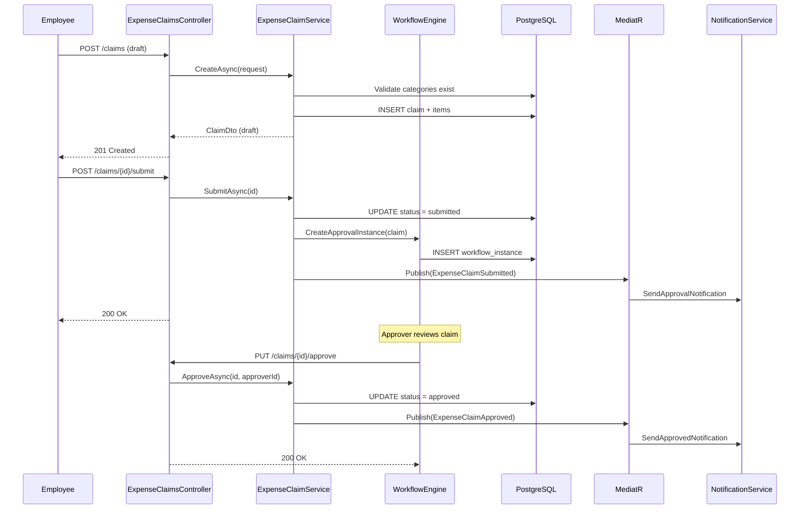

# Expense Claims — End-to-End Logic

**Module:** Expense
**Feature:** Expense Claims

---

## Flow Overview

Expense claims follow a lifecycle: **draft -> submitted -> approved/rejected -> paid**. An employee creates a claim with line items (each referencing an expense category), optionally attaches receipts, and submits for approval. The approval workflow engine routes the claim to the appropriate approver based on amount thresholds and org hierarchy.

---

## Step-by-Step Flow

### 1. Create Claim (Draft)

```
POST /api/v1/expenses/claims
Authorization: Bearer {token}  (requires expense:create)
```

1. **Controller** receives `CreateExpenseClaimRequest { Title, CurrencyCode, Items[] }`.
2. **Validation**:
   - `Title` required, max 200 chars.
   - `CurrencyCode` must be valid ISO 4217 (validated against `countries` reference data).
   - At least one item required.
   - Each item: `category_id` must exist and be active, `amount > 0`, `date` not in the future.
3. **Service** (`ExpenseClaimService.CreateAsync`):
   - Sets `employee_id` from authenticated user context.
   - Sets `status = draft`.
   - Validates each item's amount against the category's `max_amount` (if set).
   - If category has `requires_receipt = true`, validates `receipt_file_id` is present.
   - Computes `total_amount` as sum of all item amounts.
4. **Repository** inserts `expense_claims` row + `expense_items` rows in a transaction.
5. **Response**: `201 Created` with `ExpenseClaimDto` including items.

### 2. Update Draft Claim

```
PUT /api/v1/expenses/claims/{id}
Authorization: Bearer {token}  (requires expense:create)
```

1. Claim must exist, belong to current user, and be in `draft` status.
2. Items can be added, updated, or removed.
3. `total_amount` is recalculated.
4. Same validation as create.

### 3. Submit for Approval

```
POST /api/v1/expenses/claims/{id}/submit
Authorization: Bearer {token}  (requires expense:create)
```

1. Claim must be in `draft` status.
2. Final validation: all items with `requires_receipt` categories must have `receipt_file_id`.
3. **Service** sets `status = submitted`, records `submitted_at`.
4. **Workflow Engine** is invoked:
   - Determines approver based on claim total and employee's reporting line.
   - Creates `workflow_instance` entry linking to this claim.
5. **Event Published**: `ExpenseClaimSubmitted { ClaimId, EmployeeId, TotalAmount, SubmittedAt }`.
6. **Notification**: Approver receives in-app and email notification.

### 4. Approve / Reject

```
PUT /api/v1/expenses/claims/{id}/approve
PUT /api/v1/expenses/claims/{id}/reject
Authorization: Bearer {token}  (requires expense:approve)
```

1. Claim must be in `submitted` status.
2. Approver must match the assigned workflow approver.
3. **Approve path**:
   - Sets `status = approved`, records `approved_at`, `approved_by_id`.
   - **Event Published**: `ExpenseClaimApproved { ClaimId, ApprovedById, TotalAmount }`.
   - Notification sent to employee.
4. **Reject path**:
   - Sets `status = rejected`, records `rejection_reason`.
   - **Event Published**: `ExpenseClaimRejected { ClaimId, Reason }`.
   - Notification sent to employee. Claim can be edited and re-submitted.

### 5. Mark as Paid

```
PUT /api/v1/expenses/claims/{id}/pay
Authorization: Bearer {token}  (requires expense:admin)
```

1. Claim must be in `approved` status.
2. Sets `status = paid`, records `paid_at`.
3. **Event Published**: `ExpenseClaimPaid { ClaimId, PaidAt }`.

### 6. List Own Claims

```
GET /api/v1/expenses/claims/me?status=submitted
Authorization: Bearer {token}  (requires expense:read)
```

1. Returns claims for `employee_id` of current user.
2. Supports filtering by `status`, pagination, date range.

---

## Sequence Diagram



---

## Error Scenarios

| Step | Error | HTTP Status | Handling |
|:-----|:------|:------------|:---------|
| Create | Item amount exceeds category max_amount | 422 | `BusinessRuleException` with category name and limit |
| Create | Category requires receipt but receipt_file_id is null | 422 | `BusinessRuleException` |
| Submit | Claim not in draft status | 422 | `InvalidStateTransitionException` |
| Submit | Item missing required receipt | 422 | Validation error listing items without receipts |
| Approve | Not the assigned approver | 403 | `ForbiddenException` |
| Approve | Claim not in submitted status | 422 | `InvalidStateTransitionException` |
| Update | Claim not in draft status | 422 | Cannot edit after submission |
| Pay | Claim not in approved status | 422 | `InvalidStateTransitionException` |

---

## Edge Cases

1. **Re-submission after rejection**: Status goes `rejected -> draft` (reset), employee edits and re-submits.
2. **Multi-currency**: `currency_code` is stored per claim. Reporting may need FX conversion, but the claim itself stores the original currency.
3. **Receipt upload race condition**: Receipt file must exist in `file_records` before claim submission. Orphaned files are cleaned up by a background job.
4. **Approver on leave**: Workflow engine supports delegation — if primary approver is on leave, claim routes to delegate.
5. **Zero-amount claims**: Rejected at validation. At least one item with amount > 0 is required.
6. **Category deactivated after draft created**: Submit validates all categories are still active at submission time.

## Related

- [[expense-claims]] — feature overview
- [[expense-categories]] — categories referenced by expense items
- [[event-catalog]] — events produced on claim submission and approval
- [[error-handling]] — workflow state transition error patterns
